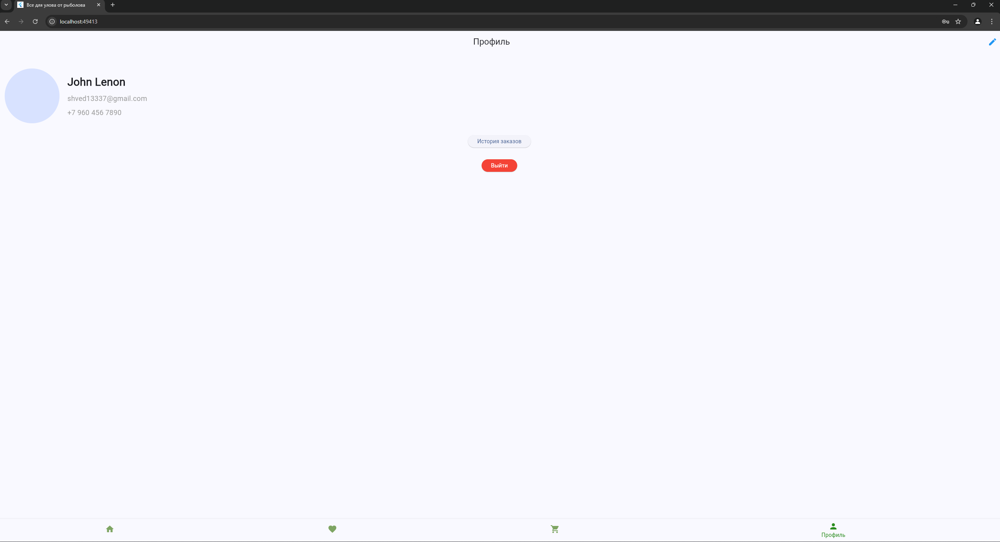
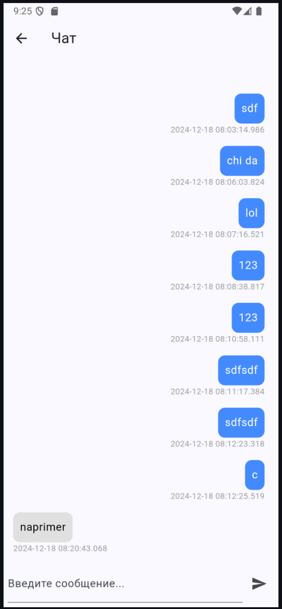

# Практика 11-12
Шведов Павел Денисович
Работа приложения

фильтр

избранное

корзина

профиль

заказы

редактирование

# Практика 13
Шведов Павел
Профиль

авторизация на firebase данные

# Практика 14 - 15
Шведов Павел

# Практика 16
шведов павел
отправил на модерацию rustore

